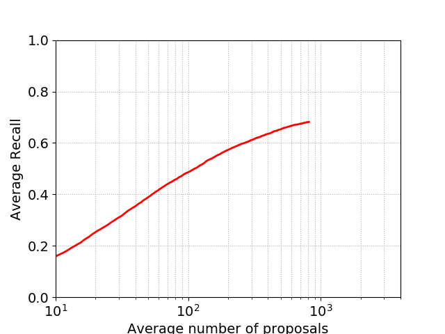
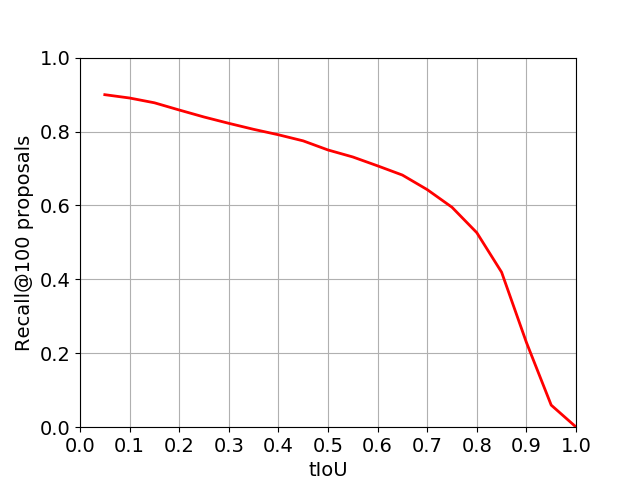
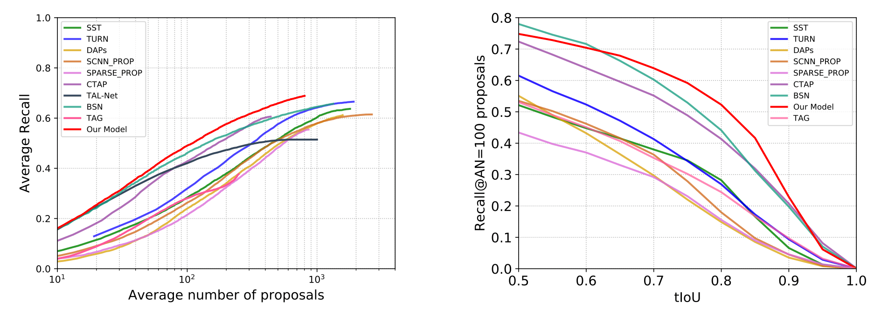

### RecapNet: Action Proposal Generation Mimicking Human Cognitive Process

This repository contains the codes for our paper named "RecapNet: Action Proposal Generation Mimicking Human Cognitive Process". You can use the test codes to evaluate our model on the THUMOS14 dataset.

#### Requirements

Python and some packages:

- tensorflow >= 1.4.0
- opencv-python
- numpy
- matplotlib
- h5py

#### Data preparation

(1) I3D feature extraction: Please download the video data and annotation files from the website [THUMOS14](http://crcv.ucf.edu/THUMOS14/download.html), and then use the scripts under `data/THUMOS14/I3D_feature_gen/` to extract the I3D features. For more details, follow the instructions in this [readme](./data/THUMOS14/I3D_feature_gen/readme.md).

(2) Video information generation: At this step, we need to reformulate the ground truth raw annotation files into parsed json files for network input. 

Instructions:

`cd ./data/THUMOS14/ && python gen_dataset_dict.py`

(3) Or just skip the above two tedious steps and take my provided I3D feature files and ground truth json files. My provided I3D features can be downloaded in [MEGA Disk](https://mega.nz/#F!SJc2hCRa!tru3N2ZGpuz9YtybIO4bqQ). The ground truth json files have already been placed under the `./data/THUMOS14/split_gt_info` directory.

#### Model Inference

Download my trained model in [MEGA Disk](https://mega.nz/#F!SJc2hCRa!tru3N2ZGpuz9YtybIO4bqQ) and place the checkpoint files under the `checkpoints` directory. 

Then run:

`CUDA_VISIBLE_DEVICES=0 python eval_model.py`

You will obtain a `prop.json` file containing the generated action proposals.

#### Metric Evaluation

Run `python eval_metric_plot.py` to get the AR-AN and R@AN=100-tIoU results. You will get two figures like the following:

You will also get two hdf5 files containing the raw coordinate data of the above two figures.

#### Comparasion with the SOTA

RecapNet outperforms all the state-of-the-art action proposal methods. The comparasions are shown in the following two figures:

